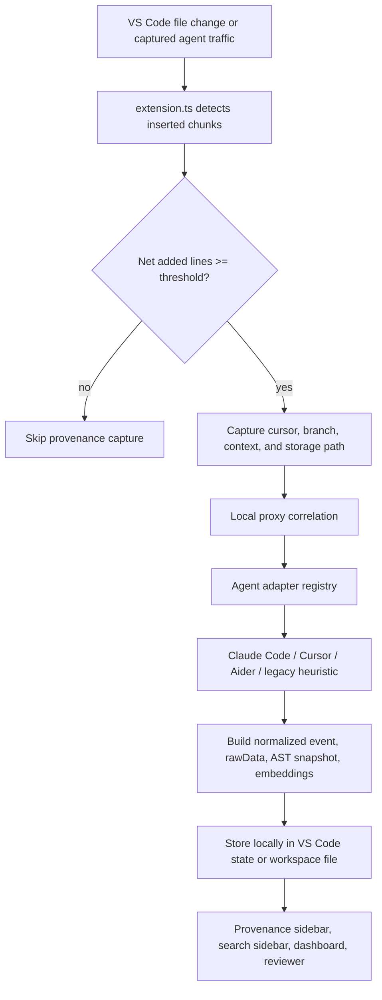
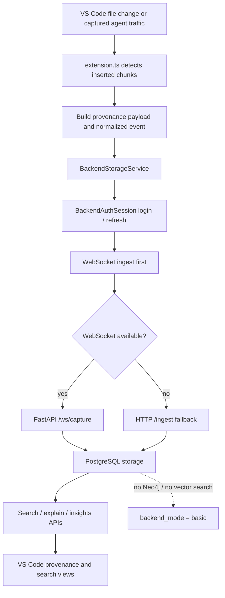
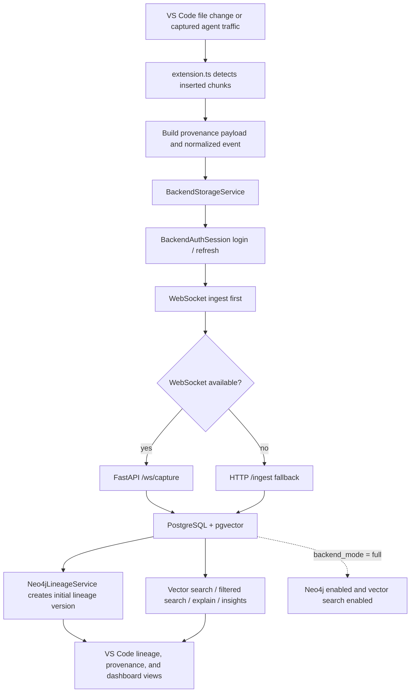

# LineageLens Current Codebase Logic

Last reviewed from the local codebase: 2026-04-19

## 1. What The System Does

LineageLens is a provenance system for AI-generated code. It works with any tool that writes files — Claude Code, Cursor, Aider, Copilot, or anything else. The current detection host is a VS Code extension, but the provenance event contract, backend, and agent adapter system are all tool-agnostic. The extension detects file changes, correlates them with nearby LLM traffic, identifies the originating tool, and produces normalized provenance records.

The current implementation supports three operating modes:

- Solo mode: local-only storage inside VS Code.
- Team mode: backend basic, with PostgreSQL and no Neo4j or vector search.
- Enterprise mode: backend full, with PostgreSQL, Neo4j lineage, and vector search.

For Team and Enterprise usage, the important part is the agent traffic and backend, not only the VS Code UI. The current codebase already recognizes Claude Code, Cursor, Aider, and a legacy heuristic path as agent sources.

## 2. Main Runtime Pieces

- `src/extension.ts` orchestrates detection, correlation, provenance building, storage, and UI updates.
- `src/proxy.ts` captures local outbound LLM traffic and classifies captures as `full`, `metadata_only`, `tunnel_only`, or `unavailable`.
- `src/correlation.ts` matches qualifying insertions to recent proxy request/response pairs.
- `src/eventSchema.ts` defines the provider-agnostic provenance event contract.
- `src/provenance.ts` defines the provenance record shape, AST normalization, and deterministic local embeddings.
- `src/agentAdapters/*` detects agent/tool context for Cursor, Claude Code, Aider, and legacy heuristic fallback.
- `src/storage/*` switches between local and backend storage services.
- `src/backend.ts` and `src/backendAuth.ts` handle backend transport, login, token refresh, and ingest retries.
- `src/provenanceSidebar.ts`, `src/provenanceSearchSidebar.ts`, `src/insightsDashboard.ts`, and `src/reviewer.ts` expose the user-facing surfaces.
- `backend/app/*` provides auth, ingest, search, explain, insights, and websocket capture APIs.
- `scripts/run-backend-native.ps1` and `scripts/test-backend-native.ps1` provide the no-Docker backend path.

## 3. End-to-End Capture Flow

1. A file is opened or changed in the editor (the change can come from any tool — Claude Code, Aider, manual edits, etc.).
2. The detection host keeps the previous document snapshot for that URI.
3. On change, it extracts inserted chunks and calculates net added lines.
4. If the insertion passes the configured threshold, it captures cursor position, surrounding text, current git branch, and a normalized storage path.
5. The local proxy runtime contributes recent request/response pairs for correlation.
6. The agent adapter registry tries to identify the likely tool or provider and records confidence plus evidence.
7. That registry already understands Cursor, Claude Code, Aider, and a legacy heuristic fallback, so non-VS Code agent traffic can still be attributed when it reaches the proxy.
8. The extension builds a `DetectionPayload`, a `PromptCorrelationResult`, a `ContextSnapshot`, and a `ProvenanceRecord`.
9. The record includes normalized event data, raw capture data, AST tokens, deterministic embeddings, and risk metadata.
10. The active storage service decides whether the record stays local or is sent to the backend.
11. The provenance sidebar, search sidebar, dashboard, and reviewer read the active storage service to present the record back to the user.

## 4. Agent Sources

The adapter layer already supports these agent sources:

- Claude Code
- Cursor
- Aider
- Legacy heuristic fallback for older or partial fingerprints

These are not separate IDE shims in the current repo. They are agent identities inferred from traffic, headers, user-agent strings, payload shapes, and routing hints. That is why Team and Enterprise can still talk about Claude Code or Cursor even if the primary UI is not VS Code-only in the user's workflow.

## 5. Provenance Data Model

The current provenance record is intentionally layered so that the system can degrade gracefully when capture quality is poor.

Stored record data includes:

- identity: UUID, request UUID, workspace ID, and timestamps
- insertion data: inserted code, cursor location, file path, file URI
- context data: surrounding text and captured context snapshot
- correlation data: proxy match confidence, evidence, and capture status
- normalized data: provider-agnostic event schema fields
- raw data: original detection payload and raw proxy fragments
- semantic data: local embeddings, backend embeddings, and AST tokens
- metadata: model info, branch info, and risk annotations

The normalized event schema keeps the record portable across providers and future IDE shims. Extra or unknown information stays in `extensions` rather than forcing schema changes.

## 6. Correlation and Adapter Logic

Correlation runs after a qualifying insertion is detected.

- `src/correlation.ts` looks for proxy traffic in the configured window and ignores captures that are unavailable.
- Timing, file context, capture status, and response similarity all contribute to the final confidence.
- If timing is ambiguous, the matcher can compare the generated response and inserted code with string similarity.
- A proxy request is claimed once matched so repeated insertions do not reuse the same prompt.

Agent detection runs in parallel with correlation.

- Cursor, Claude Code, and Aider have dedicated detectors.
- A legacy heuristic adapter remains for older or opaque provider fingerprints.
- Each adapter reports capabilities such as prompt body, response body, headers, session IDs, model name, and workspace hints.
- The registry sorts candidates by confidence and adapter order, then stores the winning match and evidence.

## 7. Storage and Backend Behavior

The storage layer is split into local and backend implementations.

### Local Storage

`src/storage/LocalStorageService.ts` keeps records in VS Code global state by default, with optional workspace file storage at `.vscode/ai-provenance/records.json`.

- Search uses local keyword scoring with path-aware filters.
- Explanations default to a template and can optionally call a local Ollama endpoint.
- Local lineage is derived from previous records in the same file and from AST-token similarity.
- This mode is the default for Solo usage and requires no backend.

### Backend Storage

`src/storage/BackendStorageService.ts`, `src/backend.ts`, and `src/backendAuth.ts` move records to the backend.

- WebSocket ingest is attempted first.
- HTTP ingest is the fallback if websocket transport fails.
- Tokens are stored in VS Code Secret Storage and refreshed before expiry.
- The backend expects workspace-scoped auth and a valid API version header.

### Backend Services

The FastAPI backend exposes:

- `GET /health`
- `POST /auth/register`
- `POST /auth/login`
- `POST /auth/refresh`
- `GET /auth/me`
- `POST /ingest`
- `WS /ws/capture`
- `GET /provenance/{uuid}`
- `POST /search`
- `POST /explain`
- `GET /explain/system-prompt`
- `POST /insights/dashboard`

Backend startup initializes the database and, when enabled, Neo4j constraints and lineage services.

## 8. Mode Matrix

| Mode | Frontend storage mode | Backend mode | Datastores | Search behavior | Lineage graph |
| --- | --- | --- | --- | --- | --- |
| Solo | `local` | none | VS Code storage or workspace file | local keyword scoring | local lineage only |
| Team | `backend` | `basic` | PostgreSQL | keyword fallback search when vector search is off | Neo4j disabled |
| Enterprise | `backend` | `full` | PostgreSQL + Neo4j | vector search plus filters | Neo4j lineage enabled |

Mode wiring is controlled by configuration and environment values:

- Extension storage mode: `aiCodeProvenance.mode`
- Backend base URL and websocket URL: `aiInsertionDetector.backend.baseUrl` and `aiInsertionDetector.backend.websocketUrl`
- Backend mode: `BACKEND_MODE=basic` or `BACKEND_MODE=full`
- Team flags: `NEO4J_ENABLED=false`, `VECTOR_SEARCH_ENABLED=false`
- Enterprise flags: `NEO4J_ENABLED=true`, `VECTOR_SEARCH_ENABLED=true`

## 9. Graphs For Each Mode

### Solo Mode

Solo mode keeps all provenance on the workstation and does not require backend services.

### Team Mode

Team mode moves shared provenance into the backend while keeping the graph layer off. Search falls back to keyword scoring when vector search is disabled.

### Enterprise Mode

Enterprise mode adds lineage graph persistence and vector search on top of the Team flow.

## 10. Native And Docker Launch Paths

The backend can run without Docker Desktop.

- Native Team: `npm run native:team`
- Native Enterprise: `npm run native:enterprise`
- Native backend tests: `npm run native:test`

The Docker shipping paths remain available for release packaging:

- `docker compose -f docker-compose.team.yml up`
- `docker compose -f docker-compose.enterprise.yml up`

## 11. Security And Limits

Current safeguards include:

- proxy header redaction for sensitive headers
- environment snapshot filtering for secret-like variables
- JWT authentication and workspace-scoped authorization
- HTTP and websocket rate limiting
- HTTP and websocket payload size limits
- trusted host and CORS controls in the backend
- strict JWT secret validation in backend settings

Backend settings also enforce a fixed pgvector dimension of 256 so the schema and the embedding storage stay aligned.

## 12. Current Validation Surface

TypeScript tests cover adapter detection, correlation behavior, event schema behavior, insights logic, and storage path handling.

Backend tests cover configuration validation, insights service behavior, and security helpers.

The native backend test path runs through the local `.venv` and exercises the Python backend test suite without Docker Desktop.

## 13. One-Sentence Summary

LineageLens uses VS Code as its current observation host to detect AI-assisted code insertions from Claude Code, Cursor, Aider, or any tool that writes files, correlates them with local or backend capture sources, normalizes them into a portable provenance record, and exposes provenance, review, dashboard, and lineage views across Solo, Team, and Enterprise modes.
