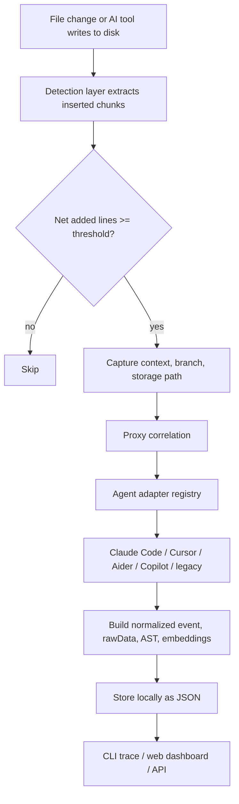
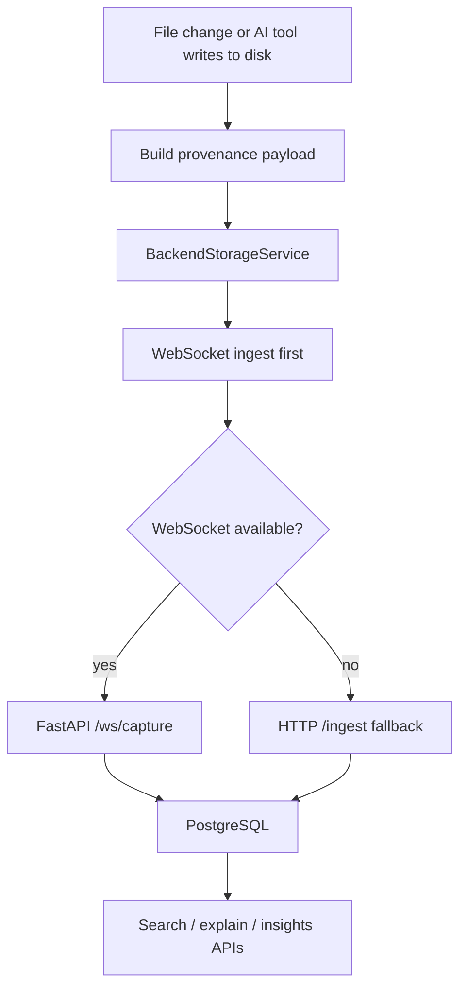
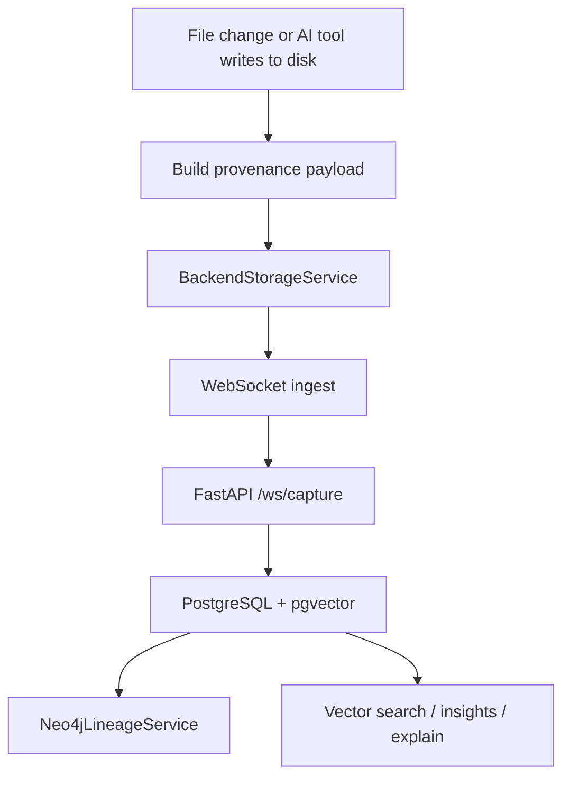

# LineageLens Architecture

Last reviewed: 2026-04-29

## 1. What The System Does

LineageLens is an AI code intelligence platform. It captures every significant code insertion made by any AI coding tool — Claude Code, Cursor, Aider, GitHub Copilot, Codeium, Windsurf, Continue, Sourcegraph Cody, Amazon Q, Gemini CLI, OpenAI Codex — and links each insertion to its prompt, model, session, and developer.

The capture layer, provenance record schema, agent adapter system, and backend are all editor-agnostic. Any tool that writes files and routes traffic through the proxy can have its insertions tracked and attributed.

The system supports three operating modes:

- **Base** — local-only storage, no backend required.
- **Plus** — backend-backed storage with PostgreSQL, no Neo4j or vector search.
- **Max** — full backend with PostgreSQL, Neo4j lineage, and vector search.

---

## 2. Main Runtime Pieces

- `src/proxy.ts` — captures outbound LLM traffic and classifies captures as `full`, `metadata_only`, `tunnel_only`, or `unavailable`.
- `src/correlation.ts` — matches qualifying insertions to recent proxy request/response pairs.
- `src/eventSchema.ts` — defines the provider-agnostic provenance event contract.
- `src/provenance.ts` — defines the provenance record shape, AST normalization, and deterministic local embeddings.
- `src/agentAdapters/*` — detects agent/tool context for Cursor, Claude Code, Aider, Copilot, Codeium, Continue, Cody, Amazon Q, Gemini CLI, Codex CLI, and a legacy heuristic fallback.
- `src/storage/*` — switches between local and backend storage services.
- `src/lightweightRecord.ts` — editor-free record builder for CLI, scripts, and CI jobs.
- `backend/app/*` — provides auth, ingest, search, explain, insights, and WebSocket capture APIs.

---

## 3. End-to-End Capture Flow

1. A file is changed in any editor or by any AI tool writing directly to disk.
2. The detection layer keeps the previous snapshot for that file path.
3. On change, it extracts inserted chunks and calculates net added lines.
4. If the insertion passes the configured threshold, it captures cursor position, surrounding text, current git branch, and a normalized storage path.
5. The local proxy runtime contributes recent request/response pairs for correlation.
6. The agent adapter registry identifies the originating tool and records confidence plus evidence.
7. A `DetectionPayload`, `PromptCorrelationResult`, `ContextSnapshot`, and `ProvenanceRecord` are assembled.
8. The record includes normalized event data, raw capture data, AST tokens, deterministic embeddings, and risk metadata.
9. The active storage service stores the record locally or sends it to the backend.

---

## 4. Agent Sources

The adapter layer supports these agent sources:

- Claude Code
- Cursor
- GitHub Copilot
- Aider
- Codeium / Windsurf
- Continue.dev
- Sourcegraph Cody
- Amazon Q Developer
- Gemini CLI
- OpenAI Codex CLI
- Legacy heuristic fallback for older or partial fingerprints

These are not editor shims. They are agent identities inferred from traffic, headers, user-agent strings, payload shapes, and routing hints. Any tool that routes through the proxy is attributable regardless of which editor is in use.

---

## 5. Provenance Data Model

Every provenance record is layered so the system degrades gracefully when capture quality is poor.

Stored record data includes:

- **Identity** — UUID, request UUID, workspace ID, timestamps
- **Insertion data** — inserted code, cursor location, file path, file URI
- **Context data** — surrounding text and context snapshot
- **Correlation data** — proxy match confidence, evidence, and capture status
- **Normalized data** — provider-agnostic event schema fields
- **Raw data** — original detection payload and raw proxy fragments
- **Semantic data** — local embeddings, backend embeddings, and AST tokens
- **Metadata** — model info, branch info, and risk annotations

The normalized event schema keeps records portable across providers, editors, and future integrations.

---

## 6. Correlation and Adapter Logic

**Correlation** runs after a qualifying insertion is detected.

- Looks for proxy traffic in the configured window.
- Timing, file context, capture status, and response similarity all contribute to final confidence.
- If timing is ambiguous, the matcher compares the generated response and inserted code with string similarity.
- A proxy request is claimed once matched so repeated insertions do not reuse the same prompt.

**Adapter detection** runs in parallel with correlation.

- Each adapter reports capabilities: prompt body, response body, headers, session IDs, model name, workspace hints.
- The registry sorts candidates by confidence and adapter order, then stores the winning match and evidence.
- When no adapter matches confidently, the legacy heuristic adapter fires as a fallback.

---

## 7. Storage and Backend Behavior

### Local Storage

`src/storage/LocalStorageService.ts` keeps records in a JSON file.

- Search uses local keyword scoring with path-aware filters.
- Explanations default to a template and can optionally call a local Ollama endpoint.
- Local lineage is derived from previous records in the same file and from AST-token similarity.
- Default mode for Base. No backend required.

### Backend Storage

`src/storage/BackendStorageService.ts` sends records to the FastAPI backend.

- WebSocket ingest is attempted first.
- HTTP ingest is the fallback if WebSocket transport fails.
- Tokens are stored securely and refreshed before expiry.
- The backend expects workspace-scoped auth and a valid API version header.

### Backend API Endpoints

- `GET /health`
- `POST /auth/register`, `/auth/login`, `/auth/refresh`, `/auth/logout`, `GET /auth/me`
- `POST /ingest`
- `WS /ws/capture`
- `GET /provenance/{uuid}`, `POST /explain`
- `POST /search`
- `POST /insights/dashboard`
- `GET /export/audit`

---

## 8. Mode Matrix

| Mode | Storage | Backend mode | Datastores | Search | Lineage |
|------|---------|-------------|-----------|--------|---------|
| Base | Local JSON | none | Local file | Keyword scoring | Local only |
| Plus | Backend | `team` | PostgreSQL | Keyword fallback | Neo4j disabled |
| Max | Backend | `enterprise` | PostgreSQL + Neo4j | Vector + filters | Neo4j enabled |

Mode wiring is controlled by config and environment:

- Storage mode: `mode` in config (`local` or `backend`)
- Backend URL: `backendUrl`
- Backend mode: `BACKEND_MODE=team` or `BACKEND_MODE=enterprise`
- Plus flags: `NEO4J_ENABLED=false`, `VECTOR_SEARCH_ENABLED=false`
- Max flags: `NEO4J_ENABLED=true`, `VECTOR_SEARCH_ENABLED=true`

---

## 9. Architecture Diagrams

### Base Mode

### Plus Mode

### Max Mode

---

## 10. Security and Limits

- Proxy header redaction for sensitive headers
- Environment snapshot filtering for secret-like variables
- JWT authentication and workspace-scoped authorization
- HTTP and WebSocket rate limiting
- HTTP and WebSocket payload size limits
- Trusted host and CORS controls in the backend
- Strict JWT secret validation in backend settings

---

## 11. One-Sentence Summary

LineageLens uses a transparent proxy to capture AI coding tool traffic, correlates insertions to prompts and sessions via an adapter registry, normalizes them into a portable provenance record, and exposes trace, search, dashboard, and compliance export interfaces across Base, Plus, and Max modes — independent of any specific editor.
